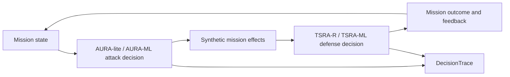

# TSRA-X / AURA DAH 2026 Agent Package

DAH 2026 `Hybrid SATCOM Disruption` 시나리오를 위한 실행 가능한 AI 공방 에이전트 프로토타입입니다.

이 저장소는 폐쇄형 C4ISR mission-event simulator 안에서 추상 공격 효과를 선택하는 rule 기반 `AURA-lite`와 학습 기반 `AURA-ML`, 데이터 신뢰성 붕괴를 탐지·완화하는 `TSRA-R-lite`, `TSRA-ML`을 실행하고 비교합니다. 각 에이전트가 무엇을 관측하고 어떤 도구와 후보 행동을 검토해 왜 특정 행동을 선택했는지도 `DecisionTrace`로 남깁니다.

> 이 프로젝트는 실제 SATCOM/RF 공격 도구가 아닙니다. 실제 장비 침투, exploit code, 운용 가능한 RF 파라미터, 장비별 공격 절차를 포함하지 않습니다.

## 누가 무엇부터 읽어야 하나

이 README의 우선 독자는 팀에 새로 합류한 개발자와 최종 제출 문서 제작자입니다.

| 독자 | 먼저 확인할 내용 | 권장 순서 |
|---|---|---|
| 다른 개발자 | 실행 경로, agent/runtime 경계, 테스트, 모델 변경 절차 | `한눈에 보기` → `빠른 실행` → `저장소 구조` → [`docs/agent_engineering_notes.md`](docs/agent_engineering_notes.md) |
| 최종 제출 문서 제작자 | 최종 수치, 안전한 주장, 표·문장, 한계 | `핵심 검증 결과` → `보고서 작성자를 위한 안내` → [`docs/report_writer_guide.md`](docs/report_writer_guide.md) |

수치 근거는 목적에 따라 구분합니다.

- 최종 모델 정의와 5-seed 개발 결과: [`models/tsra_final_selection_report.json`](models/tsra_final_selection_report.json)
- 최종 제출 성능의 주 근거: [`examples/holdout_30_seed_summary.json`](examples/holdout_30_seed_summary.json)
- AURA-ML 공격 모델 및 독립 평가: [`examples/aura_ml_holdout_30_seed_summary.json`](examples/aura_ml_holdout_30_seed_summary.json)
- AURA-ML 최종 선택 보고서: [`models/aura_final_selection_report.json`](models/aura_final_selection_report.json)
- 로컬 개발·회귀 기준: [`examples/summary_multi_seed.json`](examples/summary_multi_seed.json)

## 한눈에 보기

| 구성 요소 | 역할 | 판단 방식 | 주요 출력 |
|---|---|---|---|
| `AURA-lite` | Red agent | 링크 상태와 임무 영향을 바탕으로 추상 공격 효과 후보를 평가·선택 | 공격 action, 후보 점수, 판단 trace |
| `AURA-ML` | Red agent | 27개 observable feature와 ExtraTrees rollout-impact 모델, commitment guardrail 결합 | learned impact, 반사실 대조, 판단 trace |
| `TSRA-R-lite` | Blue agent | 링크·지연·stale data·priority inversion 위험을 규칙 기반으로 융합 | 경보, 우선순위 조정, PACE 전환, 완화 action |
| `TSRA-ML` | Blue agent | 학습된 위험 예측 모델, action gate, deterministic guardrail 결합 | ML 영향 action, guardrail action, 모델 기여도 |
| `MissionSimulator` | 검증 환경 | UAV/UGV/SATCOM/PACE mission event를 synthetic하게 재현 | 성능 지표, 이벤트 로그, incident report |



### 에이전트라고 부르는 이유

각 에이전트는 단순히 함수 결과만 반환하지 않습니다. 독립 `AgentRuntime`이 다음 순환을 직접 수행합니다.

1. 임무 상태를 관측합니다.
2. bounded memory와 이전 feedback을 확인합니다.
3. 등록된 callable tool을 실행합니다.
4. 여러 후보 행동을 평가합니다.
5. 행동 또는 정상 `no-op`을 선택합니다.
6. 환경 결과를 feedback으로 받아 다음 판단에 반영합니다.

이 과정은 observation, memory, tool call, candidate action, selected action, reason, environment feedback을 포함하는 JSONL trace로 기록됩니다.

## 핵심 검증 결과

제출 성능의 주 근거는 모델 학습과 정책 튜닝에 사용하지 않은 **독립 30-seed post-tuning holdout**입니다. 원본은 [`examples/holdout_30_seed_summary.json`](examples/holdout_30_seed_summary.json)에 있습니다.

| 조건 | Mission impact 평균 | Resilience gain 평균 | 해석 |
|---|---:|---:|---|
| 공격만 적용 | `82.3653` | - | 방어가 없는 공격 조건 |
| 단순 rule defense | `60.0803` | `30.2197%` | 제한적인 기준 방어 |
| `TSRA-R-lite` | `16.2180` | `89.8057%` | risk fusion과 mission guardrail 적용 |
| `TSRA-ML` | **`15.3187`** | **`91.0330%`** | 학습 모델과 guardrail 결합 |
| ML 출력을 제거한 ablation | `16.9810` | `88.7730%` | 동일 구조에서 학습 모델 기여 제거 |

ML 기여도에 대한 paired 비교:

| 비교 | 평균 개선 | 30-seed 결과 | Bootstrap 95% CI |
|---|---:|---:|---:|
| TSRA-R 대비 TSRA-ML | `0.8993` impact point | `22승 / 8패` | `[0.1500, 1.6387]` |
| zero-model ablation 대비 TSRA-ML | `1.6623` impact point | `22승 / 8패` | `[0.7063, 2.7050]` |

두 신뢰구간이 0보다 크므로 이 simulator와 holdout seed 범위에서는 학습 모델이 평균적으로 성능에 기여했다고 해석할 수 있습니다. 다만 모든 seed에서 승리한 것은 아니며, 이 결과는 실제 운용 환경이 아니라 simulator seed 불확실성만 평가합니다.

최종 모델 선택에 사용한 5-seed 개발 기준은 공격 단독 `82.162`, rule defense `61.228`, TSRA-R `15.306`, TSRA-ML `12.926`, zero-model ablation `15.180` mission impact입니다. 이때 TSRA-R/TSRA-ML resilience gain은 각각 `90.374%`/`93.600%`, learned-model contribution은 `2.254` point, attacked priority inversion rate는 `0.0629`였습니다. 이 값은 개발·회귀 기준이며 최종 성능 주장에는 위 30-seed holdout을 우선 사용합니다.

추가 검증 결과:

- no-attack 30-seed guarded baseline false alarm rate: `0.0`
- synthetic holdout F1: `0.9884`
- synthetic holdout ROC-AUC: `0.9995`

개발에 사용한 5-seed 결과와 모델 선택 과정은 [`models/tsra_final_selection_report.json`](models/tsra_final_selection_report.json)에 별도로 기록되어 있습니다. 최종 성능 주장에는 5-seed 개발 결과보다 위 30-seed holdout을 우선 사용하십시오.

## 빠른 실행

### 1. 환경 준비

Python `3.11`과 `scikit-learn 1.9.x` 환경을 권장합니다.

```bash
conda create -n tsra-x python=3.11 -y
conda activate tsra-x
python -m pip install -r requirements.txt
```

필수 환경변수, API key, 외부 서비스 credential은 없습니다. 모든 실행은 로컬 synthetic simulator 내부에서 완결됩니다.

훈련된 모델은 `models/aura_rollout_policy.joblib`과 `models/tsra_sklearn_policy.joblib`에 포함되어 있으므로 일반 실행에는 재훈련이 필요하지 않습니다.

### 2. 기본 실험 실행

```bash
python -m src.tsra_agent.cli \
  --scenario hybrid \
  --ticks 180 \
  --seeds 7,11,19,23,31 \
  --output-dir outputs/final_run
```

같은 전체 실험군을 trained `AURA-ML` 공격 정책으로 실행:

```bash
python -m src.tsra_agent.cli \
  --scenario hybrid \
  --attack-policy ml \
  --ticks 180 \
  --seeds 3001,3011,3019 \
  --output-dir outputs/aura_ml_run
```

주요 생성 파일:

| 파일 | 용도 |
|---|---|
| `summary.json` | 실험군별 seed 결과와 평균 지표 |
| `incident_report.md` | 보고서에 활용할 수 있는 실행 요약 |
| `run_manifest.json` | 실행 조건, 산출물, 안전 경계 |
| `seed_<seed>/*_events.jsonl` | simulator 이벤트 로그 |
| `seed_<seed>/*_decision_traces.jsonl` | 에이전트의 판단 과정 |

### 3. 결과 검증

```bash
python -m unittest discover -s tests -v
python scripts/verify_submission_state.py --require-dev --require-clean
```

최종 검증기는 compile, unit test, CLI smoke run, 모델·canonical metric 해시, DecisionTrace 계약, 후보 행동과 실제 행동의 일치, 안전 경계 문서, 제출 ZIP 구성을 함께 확인합니다. canonical 30-seed 결과 전체를 매번 재실행하는 명령은 아니며 GitHub Actions 대신 로컬에서 직접 실행합니다.

## 제출용 부가자료

DAH 2026 예선 안내서의 권장 파일명과 ZIP 구성을 따릅니다.

```bash
python scripts/build_submission_zip.py
```

생성 파일: `dist/DAH2026_소스코드_TSRA-X.zip`

ZIP 최상위 구성:

- `README.md`: 실행 방법, 의존성, 환경 조건, 환경변수
- `src/`: 공격·방어 에이전트와 simulator 코드
- `requirements.txt`: Python 의존성
- `docs/`: 아키텍처, 평가 계획, 안전 경계, 개발 기록
- `models/`, `examples/`, `scripts/`, `tests/`: 학습 모델, 검증 근거, 재현 도구, 테스트

생성된 ZIP을 Google Drive 또는 Dropbox 등 외부 클라우드에 올린 뒤, **링크가 있는 모든 사용자가 다운로드 가능**한 권한으로 공유하고 해당 URL을 보고서 제출 페이지에 입력합니다.

## 보고서 작성자를 위한 안내

코드를 읽지 않고 보고서를 작성한다면 다음 순서로 확인하십시오.

1. [`docs/report_writer_guide.md`](docs/report_writer_guide.md): 보고서 구성, 사용 가능한 문장, 지표 표, 금지 표현
2. [`examples/holdout_30_seed_summary.json`](examples/holdout_30_seed_summary.json): 최종 holdout 수치
3. [`examples/aura_ml_holdout_30_seed_summary.json`](examples/aura_ml_holdout_30_seed_summary.json): 공격 모델의 별도 holdout 수치
4. [`docs/architecture.md`](docs/architecture.md): 시스템 구조와 agent loop
5. [`docs/agent_engineering_notes.md`](docs/agent_engineering_notes.md): 기술 선택, ML 기여도, 한계
6. [`docs/safety_boundary.md`](docs/safety_boundary.md): 실제 공격 도구와 구분되는 안전 경계

DecisionTrace를 사람이 읽기 쉬운 표로 변환하려면 다음 명령을 사용합니다.

```bash
python scripts/summarize_decision_traces.py \
  --input-dir outputs/final_run \
  --output-csv outputs/final_run/report_tables/decision_trace_summary.csv \
  --output-md outputs/final_run/report_tables/decision_trace_summary.md
```

보고서에서는 다음과 같이 표현하는 것이 정확합니다.

> TSRA-ML은 synthetic mission-state feature로 선제 개입 위험을 추정하고, tuned action gate와 deterministic mission guardrail을 함께 사용한다. 독립 30-seed holdout에서 평균 mission impact 15.3187과 baseline-adjusted resilience gain 91.0330%를 기록했으며, TSRA-R 및 zero-model ablation 대비 평균 개선의 bootstrap 95% 신뢰구간이 0보다 높았다.

## AURA-ML 독립 30-seed 평가

AURA-ML 독립 30-seed holdout은 모델 학습·validation·정책 확인에 사용하지 않은 seed를 사용합니다. 높은 mission impact가 공격 에이전트 관점의 우수한 결과입니다.

- candidate validation top-1 optimal rate: `0.736111` (rule ranker `0.326389`)
- candidate validation mean selection regret: `0.368333` (rule ranker `1.594653`)
- versus rule defense: `+21.213`, bootstrap 95% CI `[20.0533, 22.3977]`
- versus TSRA-R: `+3.0667`, bootstrap 95% CI `[2.2703, 3.8340]`
- versus TSRA-ML: `+5.1033`, bootstrap 95% CI `[4.4097, 5.7633]`
- versus zero-model: 모든 방어 맥락에서 `30/30` seed 우세
- no-defense negative control: 평균 `+0.0373`, CI `[-0.975, 0.919]`; 4000번대 실행 전에 고정한 1.0-point 비열등성 gate 통과

첫 3000번대 fresh holdout은 무방어 평균 양수를 요구한 초기 gate를 `-0.0017`로 통과하지 못해 `examples/aura_ml_retired_holdout_30_seed_summary.json`에 폐기 보존했습니다. 모델과 정책은 바꾸지 않고, 무방어를 우월성이 아닌 비열등성 negative control로 정의한 뒤 새로운 4000번대 seed에서 위 최종 결과를 얻었습니다.

전체 AURA-ML holdout 평가 재현:

```bash
python scripts/evaluate_aura_policy.py
```

## TSRA-ML 독립 30-seed 결과 재현

아래 seed는 방어 모델 학습과 정책 튜닝에 사용한 seed와 분리되어 있습니다. 이 평가는 rule 기반 AURA를 고정한 방어 모델 holdout이며, 위 AURA-ML 공격 모델 평가와 별개입니다.

```bash
python -m src.tsra_agent.cli \
  --scenario hybrid \
  --ticks 180 \
  --seeds 101,103,107,109,113,127,131,137,139,149,151,157,163,167,173,179,181,191,193,197,199,211,223,227,229,233,239,241,251,257 \
  --output-dir outputs/holdout_30

python scripts/summarize_holdout.py \
  --input outputs/holdout_30/summary.json \
  --output examples/holdout_30_seed_summary.json
```

## 모델 재훈련 및 재튜닝

이 절차는 모델을 변경할 때만 필요합니다. 결과 비교만 할 경우 실행하지 않아도 됩니다.

Primary scikit-learn 모델 재훈련:

```bash
python scripts/train_sklearn_policy.py --samples 100000
```

AURA-ML rollout-impact 모델 재훈련:

```bash
python scripts/train_aura_rollout_policy.py
```

scikit-learn을 사용할 수 없는 환경을 위한 logistic fallback 재훈련:

```bash
python scripts/train_ml_policy.py --samples 10000 --epochs 260
```

TSRA-ML action gate 재튜닝:

```bash
python scripts/tune_ml_policy.py \
  --candidates 16 \
  --ticks 180 \
  --tune-seeds 7,11,19 \
  --validation-seeds 23,31
```

모델이나 정책을 변경한 뒤에는 반드시 30-seed holdout을 다시 실행하고 canonical 결과 파일을 갱신해야 합니다.

## 저장소 구조

| 경로 | 내용 |
|---|---|
| `src/tsra_agent/attack_agent.py` | AURA-lite/AURA-ML 공격 에이전트와 독립 runtime |
| `src/tsra_agent/attack_ml_policy.py` | 27-feature rollout-impact 모델 계약, hash 선검증, ablation |
| `src/tsra_agent/defense_agent.py` | rule, TSRA-R-lite, TSRA-ML 방어 에이전트 |
| `src/tsra_agent/runtime.py` | AgentRuntime, memory, tool, DecisionTrace 계약 |
| `src/tsra_agent/simulator.py` | synthetic C4ISR mission environment |
| `src/tsra_agent/evaluator.py` | mission impact, latency, stale ratio, inversion, resilience 평가 |
| `src/tsra_agent/cli.py` | 실험 실행과 산출물 생성 |
| `models/` | 학습 모델, fallback, config, training/tuning/selection report |
| `examples/` | 5-seed 개발 결과와 독립 30-seed holdout |
| `scripts/` | 학습, 튜닝, 검증, 요약, 패키징 도구 |
| `tests/` | runtime, agent contract, 성능, CLI 산출물 회귀 테스트 |
| `docs/aura_ml_engineering_record.md` | AURA-ML 라벨, 데이터 품질, ablation, holdout 근거 |

브랜치 비교와 통합 판단은 [`docs/agent_branch_comparison.md`](docs/agent_branch_comparison.md)에 기록되어 있습니다.

## 한계와 안전 경계

- 모든 결과는 폐쇄형 synthetic mission-event simulator에서 얻었습니다.
- holdout seed는 simulator의 stochastic loss와 delivery 차이를 평가하며 실제 운용 환경 다양성을 의미하지 않습니다.
- AURA-lite는 후보 평가·선택형 red agent이며 학습된 공격 정책은 아닙니다.
- AURA-ML은 defender 내부 alert 상태를 제외한 27-feature ExtraTrees rollout ranker이며 Hybrid·180 tick에서만 실행됩니다.
- TSRA-ML은 평균적으로 우수하지만 30개 seed 모두에서 TSRA-R보다 우수한 것은 아닙니다.
- 실제 SATCOM/RF 제어, exploit, 장비 침투, UAV/UGV 실장 연동은 구현하지 않았습니다.
- RAG, RL, XGBoost는 현재 구현이라고 주장하지 않습니다.

## 제출 ZIP 생성

```bash
python scripts/build_submission_zip.py
```

ZIP에는 `README.md`, `requirements.txt`, `src/`, `docs/`, `models/`, `scripts/`, `examples/`, `tests/`가 포함됩니다. `dist/*.zip`는 생성 산출물이므로 Git에 추적하지 않습니다. 제출 직전에 새 ZIP을 생성하고 로컬 최종 검증을 통과한 파일만 제출하십시오.
