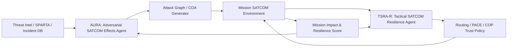

# DAH 2026 TSRA v3 재작성안

## 제목

**Hybrid SATCOM Disruption 기반 C4ISR 데이터 신뢰성 붕괴 시나리오와 AI 기반 능동 방어 에이전트**

영문 제목:

**AI-Enabled Active Defense against Hybrid SATCOM Disruption and C4ISR Data Trust Collapse**

---

## 재작성 방향

기존 v2의 핵심 약점은 공격을 `delay/loss/jitter 시뮬레이션`으로만 설명해 실제 방산 공방 시나리오의 긴장감과 기술적 완성도가 약해 보인다는 점이다. v3에서는 공격을 단순 링크 저하가 아니라 **실제 SATCOM 위협 연구와 공개 사례에 기반한 복합 공격 체계**로 재정의한다.

본 보고서의 공격자는 SATCOM을 완전히 끊는 것이 아니라, **전술 C4ISR가 의존하는 SATCOM user segment, link segment, ground support segment, mission traffic plane을 복합적으로 겨냥해 정보 흐름의 최신성, 가용성, 우선순위를 무너뜨리는 적응형 공격자**이다.

공격 세부 구현은 공개 보고서 수준에서 다룬다. 즉, 실제 악용 가능한 exploit code, 운용 가능한 RF 파라미터, 특정 장비의 침투 절차는 포함하지 않는다. 대신 **SPARTA/NIST/CISA/위성통신 보안 연구에서 다루는 현실적 공격 표면과 TTP 수준의 공격 흐름**을 기반으로 공방 에이전트를 설계한다.

---

# 2. 방산 분야 공격 시나리오 설계

## 2.1 시나리오명

> **Hybrid SATCOM Disruption을 통한 전술 C4ISR Data Trust 붕괴 및 방어 Kill Chain 지연**

## 2.2 공격 개요

본 시나리오는 전방 작전부대가 SATCOM을 primary 통신 경로로 사용하는 상황을 가정한다. UAV 영상, UGV 상태 보고, 감시초소 경보, 위치 정보, 지휘소 명령은 SATCOM 링크를 통해 지휘소 COP(Common Operational Picture)에 반영된다.

공격자는 위성체 자체를 탈취하는 고난도 공격보다, 실제 작전에서 더 노출되기 쉬운 **사용자 단말, 링크 구간, 지상 지원 인프라, 미션 트래픽 우선순위 체계**를 겨냥한다. 공격의 목표는 통신망 전체를 즉시 마비시키는 것이 아니라, 통신이 되는 것처럼 보이는 상태에서 **늦은 정보, 오래된 정보, 우선순위가 뒤집힌 정보**가 지휘 판단에 반영되게 만드는 것이다.

## 2.3 공격 목표

공격자의 작전 목표는 다음 세 가지다.

1. **C4ISR 데이터 최신성 붕괴**  
   COP에 표시되는 UAV/UGV 위치, 감시 경보, 상태 보고의 age를 증가시켜 오래된 정보가 최신 정보처럼 사용되게 한다.

2. **Critical traffic 우선순위 역전**  
   UAV 영상·상태 텔레메트리 같은 고용량 트래픽이 방공 경보·지휘 명령·좌표 메시지를 밀어내게 만든다.

3. **방어 kill chain 지연**  
   탐지 → 보고 → 식별 → 교전 승인 → 대응/복구 단계 중 보고·승인·자산 배정 구간을 늦춘다.

## 2.4 공격 표면

표 2-1. Hybrid SATCOM Disruption 공격 표면

| 공격 표면 | 현실적 약점 | 공격자가 노리는 효과 |
|---|---|---|
| SATCOM user segment | 전방 단말, 이동식 지휘차량, UAV/UGV 운용 단말, 모뎀·라우터·관리 인터페이스 | 단말별 연결 품질 저하, 설정 drift, 인증·관리 정책 오류 유발 |
| Link segment | uplink/downlink, beam coverage, 주파수 혼잡, 간섭, 기상·지형 영향 | C/N0 저하, BER 증가, RTT/loss/jitter 증가 |
| Ground support segment | 지상 게이트웨이, 운용센터, terminal provisioning, 라우팅·QoS 정책 | 대규모 단말 서비스 저하, 우선순위 정책 오작동 |
| Mission traffic plane | UAV 영상, UGV 상태, 감시 경보, 지휘 명령, 위치 정보 | critical message delay, priority inversion, stale COP |
| PACE 전환 경로 | 전술무전, LTE/5G, 메시망, store-and-forward | failover 병목, degraded-of-degraded 상황 유도 |

이 표의 핵심은 공격 표면을 “위성 하나”로 보지 않고, **방산 SATCOM 운용 체계 전체의 데이터 흐름**으로 본다는 점이다.

## 2.5 현실 근거

위성통신 위협은 이론적 가능성이 아니라 실제 사례와 공개 연구에서 반복적으로 다뤄진다.

- **Viasat KA-SAT 사건**: 2022년 러시아의 우크라이나 침공 시점에 KA-SAT 네트워크에 대한 사이버 공격이 발생했고, Viasat은 이 사건이 consumer-oriented satellite broadband service의 부분 중단을 초래했다고 설명했다. 이 사례는 위성체 자체가 아니라 지상·사용자 세그먼트가 작전 통신의 약점이 될 수 있음을 보여준다.
- **CISA/FBI SATCOM 권고**: CISA와 FBI는 미국 및 국제 SATCOM 네트워크에 대한 잠재 위협을 인지하고, SATCOM network provider와 customer 모두에게 보안 강화를 권고했다.
- **NIST IR 8401**: NIST는 위성 ground segment를 space operation의 핵심 사이버 영역으로 보고, satellite command and control에 Cybersecurity Framework를 적용한다.
- **SPARTA 프레임워크**: Aerospace Corporation의 SPARTA는 space-cyber threat의 tactics, techniques, procedures를 체계화한 공개 프레임워크다.
- **위성 시스템 보안 연구**: 최근 연구들은 ground, space, communication, user segment를 나눠 취약점과 공격 lifecycle을 분석하며, jamming, spoofing, supply chain, ground segment compromise 등을 위성 시스템 위협으로 분류한다.

따라서 본 시나리오는 단순한 네트워크 장애 시뮬레이션이 아니라, 공개 사례와 연구에 근거한 **복합 SATCOM 공격 시나리오**다.

## 2.6 공격자 모델

표 2-2. 공격자 모델

| 항목 | 내용 |
|---|---|
| 공격자 | 전술 작전 구역에서 아군 C4ISR 지연을 노리는 국가급 또는 준국가급 적대 세력 |
| 능력 | 전파 환경 관측, 공개·비공개 위협 정보 분석, SATCOM user/ground segment 약점 식별, 제한적 전자전/사이버 효과 결합 |
| 제약 | 위성체 완전 탈취는 가정하지 않음, 단일 공격으로 장시간 완전 차단하지 않음, 혼잡·장애처럼 보이는 부분 저하 선호 |
| 목표 | 네트워크 파괴가 아니라 임무 영향 극대화, 특히 COP stale data와 kill chain 지연 유도 |
| 적응성 | 방어자의 PACE 전환, 트래픽 우선순위화, 영상 축소 조치를 관측하고 다음 표적을 갱신 |

## 2.7 공격 기술 체계

본 시나리오의 공격은 네 개의 축으로 구성된다.

표 2-3. 공격 기술 체계

| 공격 축 | 설명 | 작전 효과 |
|---|---|---|
| Electronic Attack / Interference | SATCOM link segment에 부분·간헐 간섭을 유발해 C/N0 저하, loss, jitter, throughput 감소를 만든다 | 링크 품질 저하, 영상·상태 업데이트 지연 |
| User Segment Cyber Pressure | 전방 단말·모뎀·라우터·관리 정책의 취약한 지점을 식별하고, 단말군 연결 안정성을 낮추는 효과를 노린다 | 특정 단말군 서비스 저하, 설정 drift, 인증·관리 장애 |
| Ground Support Disruption | 지상 게이트웨이, 단말 provisioning, 라우팅·QoS 정책 영역을 겨냥해 넓은 사용자군에 간헐 장애를 유발한다 | 다수 단말의 부분 중단, 우선순위 정책 혼선 |
| Mission Traffic Manipulation | 데이터 자체를 위조하기보다 도착 순서, 갱신 주기, 큐 점유를 흔들어 stale data와 priority inversion을 유도한다 | COP 신뢰성 붕괴, critical message 지연 |

## 2.8 공격 단계

### Phase 0. 작전 환경 정찰 및 약점 스캔

공격자는 먼저 작전 구역의 통신 의존성을 분석한다.

- 어느 부대가 SATCOM을 primary link로 쓰는지
- UAV 영상, UGV 상태, 감시초소 경보, 지휘 명령 중 어떤 트래픽이 SATCOM에 의존하는지
- PACE 대체 경로가 전술무전, LTE/5G, 메시망 중 무엇인지
- 작전 단계별 통신 피크가 언제 발생하는지
- 단말·게이트웨이·QoS 정책 중 어떤 지점이 임무 영향이 큰지

이 단계는 공격 에이전트의 **Recon & Exposure Mapper**가 담당한다.

### Phase 1. SATCOM user/link segment 부분 저하

공격자는 특정 작전 시간대에 SATCOM user/link segment에 부분 저하를 유발한다. 이때 목표는 링크를 완전히 끊는 것이 아니라, 지휘소가 즉시 비상 절차로 들어가지 않을 정도의 불안정 상태를 만드는 것이다.

작전 영향:

- RTT, jitter, packet loss 증가
- UAV 영상 프레임 누락 또는 지연
- UGV 상태 보고 갱신 주기 증가
- 감시초소 경보와 지휘 명령 도착 지연

### Phase 2. Mission-aware traffic disruption

공격자는 임무 중요도가 높은 시점에 저하를 집중한다.

예를 들어 저고도 공중 위협이 예상되는 시간대에는 감시초소 경보와 방공 자산 배정 메시지가 늦어지게 하고, 보급 이동 시간대에는 UAV 정찰 영상과 차량 위치 보고의 freshness를 떨어뜨린다.

작전 영향:

- COP에 몇 분 전 위치·상태가 최신처럼 표시
- 방공 경보 반영 지연
- 교전 승인·자산 배정 지연
- 보급로 위험 구간 식별 지연

### Phase 3. PACE failover chasing

방어자가 SATCOM에서 대체 링크로 전환하면, 공격자는 관측 가능한 변화에 따라 저하 표적을 갱신한다.

표 2-4. 적응형 공격 루프

| 라운드 | 방어자 반응 | 공격자 적응 | 목적 |
|---|---|---|---|
| R1 | SATCOM 품질 저하 감지 | SATCOM link/user segment 저하 지속 | 초기 지연 형성 |
| R2 | 영상 품질 축소 | 경보·명령 큐의 지연을 노리는 traffic pressure 강화 | critical traffic 지연 |
| R3 | PACE 대체 링크 전환 | 대체 링크 용량·경합 상태를 표적으로 재선정 | failover 효과 감소 |
| R4 | COP stale 표시 | 오래된 정보의 동기화 회복 시점을 노려 재저하 | 지휘관 혼란·복구 지연 |

### Phase 4. 후속 작전 활용

공격자는 통신 저하 자체로 끝내지 않고, 발생한 시간차를 후속 작전에 활용한다.

표 2-5. 후속 위협 후보

| 후속 위협 | 통신 저하와의 연결 |
|---|---|
| 저고도 공중 위협 침투 | 감시초소 경보·교전 승인·방공 자산 배정 지연을 활용 |
| 보급로 차단 | UAV 정찰 영상과 차량 위치 보고의 stale data를 활용 |
| 이동식 지휘소 압박 | COP 반영 지연으로 지휘소 위치·상태 판단을 늦춤 |
| 대체 통신망 과부하 | PACE 전환 후 낮은 대역폭 링크에 critical traffic이 몰리는 순간을 활용 |

## 2.9 공격 성공 기준

공격 성공은 시스템 파괴가 아니라 **임무 영향**으로 측정한다.

표 2-6. 공격 성공 지표

| 지표 | 의미 |
|---|---|
| Critical Message Delay | 경보·명령·좌표 메시지의 P95 지연 |
| Stale Data Ratio | COP 객체 중 freshness 임계치를 초과한 비율 |
| Priority Inversion Rate | 영상·상태 트래픽이 critical traffic보다 먼저 처리된 비율 |
| Kill Chain Delay | 탐지→보고→식별→승인→대응 단계의 누적 지연 |
| Recovery Instability | PACE 전환 이후 재저하로 인해 복구가 반복된 횟수 |
| Mission Impact Score | 위 지표를 종합한 임무 영향 점수 |

---

# 3. 공격 시나리오 대응 방어 아키텍처 수립

## 3.1 방어 목표

방어 목표는 “SATCOM을 절대 끊기지 않게 하는 것”이 아니다. 실제 작전 환경에서는 SATCOM이 저하될 수 있다. 따라서 방어 목표는 다음과 같다.

> **SATCOM이 저하되어도 critical traffic을 보장하고, 지휘소가 오래된 정보를 최신 정보로 오인하지 않게 하며, PACE 전환 이후에도 방어 kill chain을 유지하는 것**

## 3.2 능동 방어 원칙

표 3-1. 공격 축별 능동 방어 원칙

| 공격 축 | 방어 목표 | 방어 전략 |
|---|---|---|
| Electronic Attack / Interference | 링크 저하 조기 탐지 | RF·링크 텔레메트리 기반 anomaly detection, change-point detection |
| User Segment Cyber Pressure | 단말군 이상 식별 | terminal posture scoring, config drift detection, firmware/정책 무결성 점검 |
| Ground Support Disruption | 광역 서비스 저하 파악 | gateway/NOC telemetry 상관 분석, 단말군 단위 영향 범위 추정 |
| Mission Traffic Manipulation | stale data와 priority inversion 차단 | AoI/UoI 기반 freshness·urgency 평가, critical queue 보호 |
| PACE failover chasing | 대체 링크 전환 후 재공격 대응 | 링크별 가용성 점수, degraded-of-degraded 정책, adaptive routing |

## 3.3 TSRA-R: Tactical SATCOM Resilience Agent - Responder

TSRA-R은 단순 모니터링 도구가 아니라 **전자전·사이버·미션 데이터 지표를 융합해 공격 효과를 탐지하고, 통신 정책을 능동적으로 재구성하는 방어 에이전트**다.

표 3-2. TSRA-R 구성 에이전트

| 에이전트 | 입력 | 판단 | 출력 |
|---|---|---|---|
| RF/Link Health Agent | C/N0, SNR, BER, RTT, loss, jitter, throughput | link degradation score | 링크 저하 경보, 원인 후보 |
| Terminal Posture Agent | 단말 설정, 인증 상태, config drift, 재부팅/오류 로그 | terminal risk score | 격리·재인증·정책 복구 권고 |
| Ground Segment Watcher | gateway 상태, provisioning 로그, 라우팅/QoS 정책 변경 | ground-impact score | 영향 범위 추정, 운영자 알림 |
| Data Freshness Agent | source timestamp, received timestamp, sequence number | AoI/stale score | COP stale badge, 객체 신뢰도 표시 |
| Mission Urgency Agent | 메시지 종류, 작전 단계, kill chain 위치 | UoI/urgency score | priority class 재조정 |
| Critical Traffic Router | 큐 상태, 링크 용량, urgency score | routing decision | 경보·명령·좌표 우선 전송 |
| PACE Orchestrator | SATCOM/무전/LTE/메시망 상태 | best available path | PACE 전환, 최소기능모드 선언 |
| Kill Chain Guardian | 탐지→보고→승인→대응 시간 | kill-chain delay score | 지휘소 경보, 수동 절차 전환 권고 |
| Incident Commander Agent | 탐지·조치·영향 로그 | incident summary | 자동 보고서, 사후 분석 데이터 |

## 3.4 공격-방어 1:1 대응

표 3-3. 공격 기술과 방어 에이전트 대응

| 공격 기술 | 탐지 | 차단/완화 | 복구 |
|---|---|---|---|
| 부분·간헐 간섭 | RF/Link Health Agent | 링크 품질 기반 traffic shaping | PACE Orchestrator |
| terminal cyber pressure | Terminal Posture Agent | 단말 격리, 설정 롤백, 재인증 | golden config 복구 |
| ground support disruption | Ground Segment Watcher | 영향 단말군 분리, QoS 정책 검증 | provisioning 재동기화 |
| stale data 유도 | Data Freshness Agent | COP stale badge, 오래된 객체 회색 처리 | store-and-forward 재정렬 |
| priority inversion | Mission Urgency Agent, Critical Traffic Router | urgency 기반 priority queue | 누락 critical message 재전송 |
| failover chasing | PACE Orchestrator | 링크 다변화, 전환 후 안정화 감시 | degraded-of-degraded 정책 |
| kill chain 지연 | Kill Chain Guardian | 지휘소 자동 경보, 수동 절차 전환 | incident report 및 사후 분석 |

## 3.5 능동 방어 상세

### 3.5.1 전자전·링크 저하 탐지

RF/Link Health Agent는 단일 임계값이 아니라 다중 신호 상관을 사용한다. 예를 들어 C/N0 저하가 발생했지만 critical traffic 지연이 없다면 자연 변동으로 판단할 수 있다. 반대로 C/N0, packet loss, stale ratio, critical delay가 동시에 증가하면 적대적 저하 가능성을 높게 판단한다.

### 3.5.2 단말·지상 세그먼트 방어

Terminal Posture Agent는 각 단말의 설정 drift, 인증 상태, 비정상 재시작, firmware/version mismatch, 관리 정책 변경을 추적한다. Ground Segment Watcher는 특정 단말군 또는 특정 지역에서 동시다발적 장애가 발생하는지 본다. 이는 Viasat KA-SAT 사건처럼 위성체가 아니라 사용자·지상 세그먼트가 약점이 되는 상황에 대응하기 위한 구조다.

### 3.5.3 C4ISR 데이터 신뢰성 방어

Data Freshness Agent는 모든 COP 객체에 age와 confidence를 붙인다. 오래된 위치·상태·영상은 최신 정보처럼 표시하지 않고, 객체별 freshness badge를 제공한다. Mission Urgency Agent는 같은 네트워크 지연이라도 방공 경보, 교전 승인, 위치 좌표, 영상 스트림의 작전 중요도가 다르다는 점을 반영한다.

### 3.5.4 PACE 전환과 degraded-of-degraded 대응

PACE Orchestrator는 SATCOM이 저하되면 즉시 대체 링크로 전환하는 것이 아니라, 각 링크의 가용성·용량·임무 적합도를 평가한다. 모든 링크가 불안정하면 영상은 snapshot 또는 보류로 낮추고, 경보·명령·좌표만 최소 기능 모드로 보장한다.

---

# 4. AI 에이전트 설계 및 구현

## 4.1 전체 공방 구조

그림 4-1. AI 공방 에이전트 구조



## 4.2 공격 에이전트: AURA

> **AURA: Adversarial SATCOM Reconnaissance & Effects Agent**

AURA는 상대 SATCOM을 무작정 공격하는 도구가 아니라, 공개 TTP·위협 정보·작전 데이터 흐름을 기반으로 **어떤 공격 표면이 가장 큰 임무 영향을 만드는지 분석하고 공격 COA(Course of Action)를 생성하는 Red Team AI 에이전트**다.

표 4-1. AURA 구성

| 모듈 | 역할 | 기술 스택 |
|---|---|---|
| Threat Intel Ingestor | SPARTA, NIST, CISA, 공개 사고 사례, 논문 기반 TTP 수집 | RAG, vector DB, rule parser |
| Exposure Mapper | user/link/ground/traffic/PACE 구성요소를 공격 그래프로 모델링 | NetworkX, attack graph |
| Weakness Scanner | 단말·링크·트래픽·QoS·PACE의 약점 후보를 점수화 | policy scanner, anomaly pattern matcher |
| Technique Selector | 목표에 맞는 공격 축 선택: interference, user segment, ground support, traffic manipulation | multi-criteria ranking |
| Mission Effects Planner | 공격이 COP freshness, critical latency, kill chain에 미치는 영향 예측 | XGBoost/LightGBM, Bayesian optimization |
| Adaptive COA Generator | 방어자 반응을 관측해 다음 표적과 시점을 갱신 | RL 또는 evolutionary search |
| Red Report Agent | 공격 경로, 영향 자산, 예상 효과를 보고서로 생성 | LLM/RAG summarizer |

## 4.3 AURA의 상태·행동·목표

표 4-2. AURA decision model

| 구분 | 내용 |
|---|---|
| 상태 `s_t` | 작전 단계, active link, link health, terminal risk, traffic mix, queue state, COP freshness, TSRA 상태 |
| 행동 `a_t` | 공격 축 선택, 표적 segment 선택, 저하 유형 선택, timing 선택, 지속 시간 선택, 후속 작전 연결 |
| 목표 | mission impact score 최대화, detectability 최소화, PACE 복구 효과 감소 |
| 출력 | attack graph, COA card, expected mission impact, blue response hypothesis |

AURA의 목적함수는 다음과 같다.

```text
maximize MissionImpact
= α·CriticalMessageDelay
+ β·StaleDataRatio
+ γ·PriorityInversionRate
+ δ·KillChainDelay
+ ε·RecoveryInstability
- ζ·DetectabilityPenalty
```

## 4.4 방어 에이전트: TSRA-R

TSRA-R은 공격 축별로 분리된 탐지기를 두되, 최종 의사결정은 decision core에서 통합한다.

표 4-3. TSRA-R decision model

| 구분 | 내용 |
|---|---|
| 상태 `s_t` | RF/link telemetry, terminal posture, gateway 상태, message freshness, urgency, PACE 링크 점수 |
| 행동 `a_t` | 경보, 트래픽 shaping, priority queue 재설정, 단말 격리, QoS 정책 롤백, PACE 전환, COP stale 표시 |
| 목표 | mission impact score 최소화, critical traffic delivery 보장, false positive 억제 |
| 출력 | defense policy, operator alert, COP trust annotation, incident report |

## 4.5 에이전트 간 공방 루프

AURA와 TSRA-R은 같은 mission environment에서 경쟁한다. AURA는 공격 효과를 높이는 COA를 생성하고, TSRA-R은 이를 탐지·완화·복구한다. 이후 mission impact score가 양쪽에 피드백된다.

표 4-4. 공방 루프

| 라운드 | AURA | TSRA-R | 평가 |
|---|---|---|---|
| 1 | 정적 link degradation COA | 링크 이상 탐지·PACE 준비 | detection delay |
| 2 | mission-aware critical delay COA | AoI/UoI 기반 priority routing | critical latency |
| 3 | terminal/ground segment pressure COA | posture drift 탐지·정책 복구 | affected asset count |
| 4 | adaptive failover chasing COA | degraded-of-degraded 방어 | recovery stability |
| 5 | hybrid multi-vector COA | 통합 방어 정책 | mission impact score |

## 4.6 구현 기술 스택

표 4-5. 구현 기술 스택

| 영역 | 기술 |
|---|---|
| 데이터 모델 | Python, Pydantic, JSONL mission event schema |
| 공격 그래프 | NetworkX, SPARTA/NIST TTP mapping |
| 시뮬레이션 환경 | SimPy 또는 discrete-event simulator, link/queue/mission event model |
| 탐지 모델 | scikit-learn, XGBoost/LightGBM, Isolation Forest, change-point detection |
| 온라인 적응 | River, EWMA baseline, contextual bandit/RL 후보 |
| 라우팅 정책 | priority queue, deadline-aware scheduling, PACE state machine |
| 시각화 | Streamlit 또는 FastAPI dashboard, COP freshness view |
| 보고서 자동화 | event log summarizer, incident report generator |

## 4.7 프로토타입 실험

표 4-6. 실험 시나리오

| 실험 | 공격 유형 | 방어 유형 | 확인할 주장 |
|---|---|---|---|
| E1 | 공격 없음 | 기본 라우팅 | 정상 baseline 확보 |
| E2 | link degradation | 방어 없음 | 공격 유효성 확인 |
| E3 | mission-aware degradation | rule defense | 단순 임계 방어 한계 확인 |
| E4 | adaptive failover chasing | TSRA-R | 적응형 공격 대응 성능 확인 |
| E5 | hybrid attack | TSRA-R + terminal/ground watcher | 통합 방어 효과 확인 |

표 4-7. 평가 지표

| 지표 | 의미 |
|---|---|
| P95 Critical Latency | critical message의 95백분위 지연 |
| Stale Data Ratio | COP stale 객체 비율 |
| Detection Time | 공격 시작 후 탐지까지 시간 |
| False Alarm Rate | 정상 혼잡을 공격으로 오탐한 비율 |
| Recovery Time | PACE 전환 및 정상 기능 회복 시간 |
| Mission Impact Score | 작전 영향 종합 점수 |
| Resilience Gain | 방어 전후 mission impact 감소율 |

---

# 보고서 삽입용 최종 문단

본 보고서는 SATCOM 저하를 단순 네트워크 장애로 보지 않고, 전자전·사용자 세그먼트·지상 지원 세그먼트·미션 트래픽 평면이 결합된 Hybrid SATCOM Disruption으로 정의한다. 공격자는 작전 환경 정찰을 통해 SATCOM 의존성, PACE 전환 경로, 임무 트래픽 우선순위, COP 갱신 구조를 분석하고, 부분·간헐 간섭, 단말·지상 세그먼트 압박, priority inversion, stale data 유도를 결합해 C4ISR 데이터 신뢰성을 붕괴시킨다. 이에 대응하여 TSRA-R은 RF/link telemetry, terminal posture, ground segment 상태, AoI 기반 freshness, UoI 기반 mission urgency를 융합 분석하고, critical traffic routing, COP trust annotation, PACE orchestration, terminal policy recovery를 수행한다. 공격 에이전트 AURA와 방어 에이전트 TSRA-R은 mission impact score를 중심으로 공방 루프를 형성하며, 이를 통해 공격 전략의 현실성과 방어 아키텍처의 실현 가능성을 동시에 검증한다.

---

# 참고문헌 후보

[R1] DAH 2026 예선 안내서, Defense AI Cyber Security Hackathon, 2026.

[R2] CISA and FBI, “Strengthening Cybersecurity of SATCOM Network Providers and Customers,” Cybersecurity Advisory AA22-076A, 2022.

[R3] Viasat, “KA-SAT Network cyber attack overview,” Mar. 30, 2022.

[R4] S. Lightman, S. Suloway, and J. Brule, “Satellite Ground Segment: Applying the Cybersecurity Framework to Satellite Command and Control,” NIST IR 8401, 2022.

[R5] The Aerospace Corporation, “SPARTA: Space Attack Research and Tactic Analysis,” online framework.

[R6] R. Peled, E. Aizikovich, E. Habler, Y. Elovici, and A. Shabtai, “Evaluating the Security of Satellite Systems,” arXiv:2312.01330, 2023.

[R7] A. Boumeftah, O. Ben Yahia, J.-F. Frigon, G. Falco, and G. K. Kurt, “Adaptive Detection of On-Orbit Jamming for Securing GEO Satellite Links,” arXiv:2411.16588, 2024.

[R8] P. Tedeschi, S. Sciancalepore, and R. Di Pietro, “Satellite-Based Communications Security: A Survey of Threats, Solutions, and Research Challenges,” arXiv:2112.11324, 2021.

[R9] G. Fontanesi et al., “Artificial Intelligence for Satellite Communication and Non-Terrestrial Networks: A Survey,” arXiv:2304.13008, 2023.
