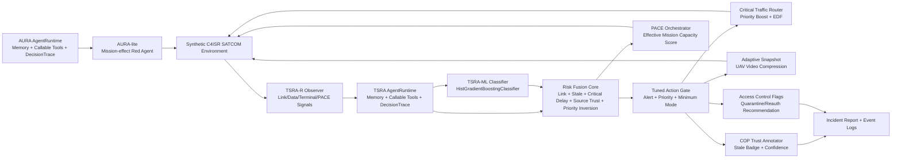

# TSRA-X Architecture

## Submission framing

TSRA-X is not an operational SATCOM attack tool. It is an AI agent architecture and prototype for DAH 2026 preliminary review:

- `AURA-lite`: bounded red-team mission-effect agent in `attack_agent.py`
- `TSRA-R-lite`: blue-team C4ISR data trust agent in `defense_agent.py`
- `TSRA-ML`: trained scikit-learn histogram gradient-boosting defense agent with mission guardrails
- `MissionSimulator`: synthetic UAV/UGV/SATCOM/PACE event environment
- `Evaluator`: mission impact and resilience score generator

## Mermaid diagram

## Agent loop

1. Observe: link health, active path, queue depth, critical latency, stale ratio, source/terminal risk, priority inversion pressure.
2. Score: compute a bounded risk score from normalized mission features.
3. Predict: TSRA-ML estimates proactive intervention probability from a trained scikit-learn histogram gradient-boosting model. A dependency-free logistic model is retained as fallback.
4. Tune: search action-gate thresholds on the simulator and persist them in `models/tsra_ml_policy_config.json`.
5. Act: alert, priority boost, EDF scheduling, minimum mode, PACE transition, SATCOM return hysteresis, adaptive UAV snapshot compression, stale badge, quarantine flag, stale noncritical backlog control.
6. Guard: mission safety guardrails keep critical traffic priority even when the model is uncertain.
7. Feedback: attach post-action queue, delivery, stale, path, health, and latency evidence to the same trace.
8. Evaluate: compare no-defense, threshold-rule defense, TSRA-R defense, and TSRA-ML defense across multiple seeds.

## Agent runtime contract

The implemented agents use an executable runtime contract rather than only returning simulator actions:

- `AgentRuntime`: owns cycle phase, tool registry, bounded memory, decision commit, and environment feedback attachment.
- `AgentMemory`: keeps recent observations, recent decisions, previous feedback, and compact belief state.
- `AgentTool`: executes a registered callable and derives `input_summary`, `output_summary`, `status`, and `safety_checked` from that invocation.
- `DecisionTrace`: persists observation, prior memory, candidate actions, actual tool results, selected action, model-risk basis, reason, post-action feedback, and safety boundary for each tick.
- `AURA-lite basis`: records no-op, link degradation, mission-aware delay, and failover-chasing candidates with eligibility, score, predicted effect, and selected candidate.
- `TSRA-ML basis`: records the scikit-learn backend, ML risk probability, heuristic risk, fused risk, weights, action-gate thresholds, model-influenced actions, and guardrail-triggered actions.

The simulator exchanges only `MissionState`, `AttackAction`, and `DefenseAction` contracts with the separately owned attack and defense agents. It no longer constructs tool records after executing policy code.

`scripts/verify_submission_state.py` validates this contract through the local CLI smoke run. A trace fails when its runtime did not execute tools, its environment feedback was not attached, its AURA ranking is inconsistent, or its TSRA-ML risk/action attribution is incomplete.

## Implemented scope

- Implemented: separate attack/defense agent ownership, callable-tool AgentRuntime, bounded memory, post-action feedback, mission-event simulator, AURA-lite attack pulses, TSRA-R risk fusion, TSRA-ML histogram gradient-boosting classifier, tuned action-gate policy, model-versus-guardrail attribution, PACE path choice and SATCOM return hysteresis, EDF scheduling, adaptive UAV snapshot compression, priority inversion detection, stale noncritical backlog control, multi-seed evaluation, event logs, and tests.
- Not implemented: trained attack policy in the DEV path, real RF control, real exploit execution, device-specific intrusion, live UAV/UGV integration, RAG/RL/XGBoost training.

Unimplemented advanced models such as RAG/RL/XGBoost are future work, not claimed as current prototype behavior.
