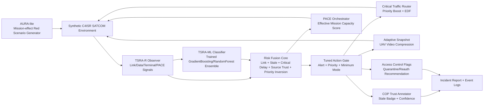

# TSRA-X Architecture

## Submission framing

TSRA-X is not an operational SATCOM attack tool. It is an AI agent architecture and prototype for DAH 2026 preliminary review:

- `AURA-lite`: bounded red-team mission-effect scenario generator
- `TSRA-R-lite`: blue-team C4ISR data trust defense agent
- `TSRA-ML`: trained scikit-learn ensemble risk defense agent with mission guardrails
- `MissionSimulator`: synthetic UAV/UGV/SATCOM/PACE event environment
- `Evaluator`: mission impact and resilience score generator

## Mermaid diagram

## Agent loop

1. Observe: link health, active path, queue depth, critical latency, stale ratio, source/terminal risk, priority inversion pressure.
2. Score: compute a bounded risk score from normalized mission features.
3. Predict: TSRA-ML estimates mission-risk probability from a trained scikit-learn soft-voting ensemble. A dependency-free logistic model is retained as fallback.
4. Tune: search action-gate thresholds on the simulator and persist them in `models/tsra_ml_policy_config.json`.
5. Act: alert, priority boost, EDF scheduling, minimum mode, PACE transition, SATCOM return hysteresis, adaptive UAV snapshot compression, stale badge, quarantine flag, stale noncritical backlog control.
6. Guard: mission safety guardrails keep critical traffic priority even when the model is uncertain.
7. Evaluate: compare no-defense, threshold-rule defense, TSRA-R defense, and TSRA-ML defense across multiple seeds.

## Agent runtime contract

The implemented agents use a lightweight runtime contract rather than only returning simulator actions:

- `AgentMemory`: keeps recent observations, recent decisions, and compact belief state.
- `AgentTool`: records a structured synthetic tool result with `tool_name`, `purpose`, `input_summary`, `output_summary`, `status`, and `safety_checked`.
- `DecisionTrace`: persists observation, memory, candidate actions, tool results, selected action, model-risk basis, reason, feedback, and safety boundary for each tick.
- `TSRA-ML basis`: records the scikit-learn backend, ML risk probability, heuristic risk, fused risk, weights, and action-gate thresholds used by each ML defense decision.

`scripts/verify_submission_state.py` validates this contract across the CLI smoke run, so missing tool fields, missing TSRA-ML risk decomposition, or unsafe tool results fail the DEV quality gate.

## Implemented scope

- Implemented: mission-event simulator, AURA-lite attack pulses, TSRA-R risk fusion, TSRA-ML scikit-learn ensemble classifier, tuned action-gate policy, structured AgentTool/DecisionTrace runtime, PACE path choice and SATCOM return hysteresis, EDF scheduling, adaptive UAV snapshot compression, priority inversion detection, stale noncritical backlog control, multi-seed evaluation, event logs, incident report, tests.
- Not implemented: real RF control, real exploit execution, device-specific intrusion, live UAV/UGV integration, RAG/RL/XGBoost training.

Unimplemented advanced models such as RAG/RL/XGBoost are future work, not claimed as current prototype behavior.
