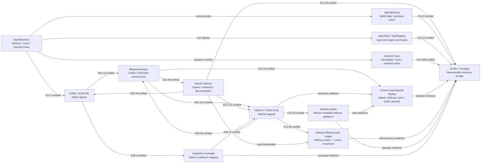

# Agent Collaboration Graph

This graph summarizes how the attack agent, simulator, defense agent, operator alerts, and metric verifier cooperate inside the closed simulation.

Safety boundary: closed simulation collaboration graph only; no RF, exploit, or live network action

## Edge Evidence

| edge_id | source | target | evidence_count | validation_status | primary_evidence | purpose |
|---|---|---|---:|---|---|---|
| E01 | AgentRuntime | AURA/AURA-ML | 4 | verified | outputs/report_tables/agent_interface_manifest.csv | Proves attack agents are not just direct function calls. |
| E02 | AURA/AURA-ML | MissionSimulator | 15 | verified | outputs/report_tables/aura_coa_cards.csv | Connects red-team decisions to simulator-visible attack effects. |
| E03 | MissionSimulator | TSRA-R/TSRA-R-ML | 122 | verified | outputs/report_tables/agent_decision_trace_summary.csv | Shows blue-team decisions are driven by runtime observations. |
| E04 | TSRA-R/TSRA-R-ML | MissionSimulator | 56 | verified | outputs/report_tables/operator_alerts.csv | Connects defense decisions to simulator-visible response actions. |
| E05 | MissionSimulator | Mission Metrics | 49 | verified | outputs/report_tables/battle_timeline.csv | Keeps the red/blue loop tied to measurable mission effects. |
| E06 | Mission Metrics | AURA/AURA-ML | 93 | verified | outputs/report_tables/agent_decision_trace_summary.csv | Shows attack choices can be interpreted through observed mission state and feedback. |
| E07 | Mission Metrics | TSRA-R/TSRA-R-ML | 122 | verified | outputs/report_tables/agent_decision_trace_summary.csv | Shows defense choices can be interpreted through observed mission state and feedback. |
| E08 | AURA Capabilities | TSRA-R Capabilities | 4 | verified | outputs/report_tables/attack_defense_coverage.csv | Makes red/blue responsibilities explicit for separate team development. |
| E09 | AttackEvent | DefenseEvent | 10 | verified | outputs/report_tables/attack_defense_response_audit.csv | Prevents static mappings from replacing actual event-time response evidence. |
| E10 | DefenseEvent | Operator Alerts | 56 | verified | outputs/report_tables/operator_alerts.csv | Turns TSRA-R output into human-readable response guidance. |
| E11 | Mission Metrics | Verifier/Package | 46 | verified | outputs/report_tables/metric_gate_summary.csv \| outputs/report_tables/mission_impact_decomposition.csv | Keeps scalar claims backed by gates and component-level evidence. |
| E12 | Attack/Defense/Alert Evidence | Closed-Loop Episode Replay | 10 | verified | outputs/report_tables/closed_loop_episode_replay.csv | Shows attack, defense, alert, and metric progression in one reviewable episode record. |
| E13 | DefenseEvent | Defense Effectiveness Ledger | 56 | verified | outputs/report_tables/defense_effectiveness_ledger.csv | Turns defensive actions into event-level effectiveness evidence. |
| E14 | AgentMemory | Verifier/Package | 9 | verified | outputs/report_tables/agent_memory_belief_audit.csv | Proves memory is active loop state, not just a static trace field. |
| E15 | AgentTool | Verifier/Package | 23 | verified | outputs/report_tables/agent_tool_usage_audit.csv | Proves tools are invoked inside agent decision loops. |
| E16 | DecisionTrace | Verifier/Package | 399 | verified | outputs/report_tables/agent_decision_causality_audit.csv | Proves selected actions are grounded in recorded decision evidence. |

## Interaction Detail

### E01 AgentRuntime -> AURA/AURA-ML

- Interaction: DecisionTrace runtime wraps observe, memory, tools, candidates, selected action, and feedback
- Evidence: outputs/report_tables/agent_interface_manifest.csv
- Evidence count: 4
- Validation status: verified
- Purpose: Proves attack agents are not just direct function calls.
- Safety boundary: closed simulation collaboration graph only; no RF, exploit, or live network action

### E02 AURA/AURA-ML -> MissionSimulator

- Interaction: AttackEvent simulated effects are emitted into the closed mission environment
- Evidence: outputs/report_tables/aura_coa_cards.csv
- Evidence count: 15
- Validation status: verified
- Purpose: Connects red-team decisions to simulator-visible attack effects.
- Safety boundary: closed simulation collaboration graph only; no RF, exploit, or live network action

### E03 MissionSimulator -> TSRA-R/TSRA-R-ML

- Interaction: MissionState and metric signals are observed by defense agents
- Evidence: outputs/report_tables/agent_decision_trace_summary.csv
- Evidence count: 122
- Validation status: verified
- Purpose: Shows blue-team decisions are driven by runtime observations.
- Safety boundary: closed simulation collaboration graph only; no RF, exploit, or live network action

### E04 TSRA-R/TSRA-R-ML -> MissionSimulator

- Interaction: DefenseEvent records feed bounded mitigation back into the simulator
- Evidence: outputs/report_tables/operator_alerts.csv
- Evidence count: 56
- Validation status: verified
- Purpose: Connects defense decisions to simulator-visible response actions.
- Safety boundary: closed simulation collaboration graph only; no RF, exploit, or live network action

### E05 MissionSimulator -> Mission Metrics

- Interaction: MetricSnapshot and battle timeline expose mission impact movement
- Evidence: outputs/report_tables/battle_timeline.csv
- Evidence count: 49
- Validation status: verified
- Purpose: Keeps the red/blue loop tied to measurable mission effects.
- Safety boundary: closed simulation collaboration graph only; no RF, exploit, or live network action

### E06 Mission Metrics -> AURA/AURA-ML

- Interaction: Metric feedback appears in AURA DecisionTrace rows
- Evidence: outputs/report_tables/agent_decision_trace_summary.csv
- Evidence count: 93
- Validation status: verified
- Purpose: Shows attack choices can be interpreted through observed mission state and feedback.
- Safety boundary: closed simulation collaboration graph only; no RF, exploit, or live network action

### E07 Mission Metrics -> TSRA-R/TSRA-R-ML

- Interaction: Metric feedback appears in TSRA-R DecisionTrace rows
- Evidence: outputs/report_tables/agent_decision_trace_summary.csv
- Evidence count: 122
- Validation status: verified
- Purpose: Shows defense choices can be interpreted through observed mission state and feedback.
- Safety boundary: closed simulation collaboration graph only; no RF, exploit, or live network action

### E08 AURA Capabilities -> TSRA-R Capabilities

- Interaction: Attack-defense coverage maps each attack capability to defense capabilities
- Evidence: outputs/report_tables/attack_defense_coverage.csv
- Evidence count: 4
- Validation status: verified
- Purpose: Makes red/blue responsibilities explicit for separate team development.
- Safety boundary: closed simulation collaboration graph only; no RF, exploit, or live network action

### E09 AttackEvent -> DefenseEvent

- Interaction: Response audit verifies required defenses are active or timely
- Evidence: outputs/report_tables/attack_defense_response_audit.csv
- Evidence count: 10
- Validation status: verified
- Purpose: Prevents static mappings from replacing actual event-time response evidence.
- Safety boundary: closed simulation collaboration graph only; no RF, exploit, or live network action

### E10 DefenseEvent -> Operator Alerts

- Interaction: Defense events are translated into operator-facing mission rationale
- Evidence: outputs/report_tables/operator_alerts.csv
- Evidence count: 56
- Validation status: verified
- Purpose: Turns TSRA-R output into human-readable response guidance.
- Safety boundary: closed simulation collaboration graph only; no RF, exploit, or live network action

### E11 Mission Metrics -> Verifier/Package

- Interaction: Metric gates and mission decomposition are included in final verification
- Evidence: outputs/report_tables/metric_gate_summary.csv | outputs/report_tables/mission_impact_decomposition.csv
- Evidence count: 46
- Validation status: verified
- Purpose: Keeps scalar claims backed by gates and component-level evidence.
- Safety boundary: closed simulation collaboration graph only; no RF, exploit, or live network action

### E12 Attack/Defense/Alert Evidence -> Closed-Loop Episode Replay

- Interaction: Each attack episode is joined to response coverage, operator alerts, and metric movement
- Evidence: outputs/report_tables/closed_loop_episode_replay.csv
- Evidence count: 10
- Validation status: verified
- Purpose: Shows attack, defense, alert, and metric progression in one reviewable episode record.
- Safety boundary: closed simulation collaboration graph only; no RF, exploit, or live network action

### E13 DefenseEvent -> Defense Effectiveness Ledger

- Interaction: Each TSRA-R defense event is joined to local metric movement before and after response
- Evidence: outputs/report_tables/defense_effectiveness_ledger.csv
- Evidence count: 56
- Validation status: verified
- Purpose: Turns defensive actions into event-level effectiveness evidence.
- Safety boundary: closed simulation collaboration graph only; no RF, exploit, or live network action

### E14 AgentMemory -> Verifier/Package

- Interaction: Memory and belief-state audit verifies evolving memory plus previous-action carryover
- Evidence: outputs/report_tables/agent_memory_belief_audit.csv
- Evidence count: 9
- Validation status: verified
- Purpose: Proves memory is active loop state, not just a static trace field.
- Safety boundary: closed simulation collaboration graph only; no RF, exploit, or live network action

### E15 AgentTool -> Verifier/Package

- Interaction: Tool usage audit verifies tool invocation, input summaries, and output summaries
- Evidence: outputs/report_tables/agent_tool_usage_audit.csv
- Evidence count: 23
- Validation status: verified
- Purpose: Proves tools are invoked inside agent decision loops.
- Safety boundary: closed simulation collaboration graph only; no RF, exploit, or live network action

### E16 DecisionTrace -> Verifier/Package

- Interaction: Decision causality audit verifies selected actions against candidates, tools, and score evidence
- Evidence: outputs/report_tables/agent_decision_causality_audit.csv
- Evidence count: 399
- Validation status: verified
- Purpose: Proves selected actions are grounded in recorded decision evidence.
- Safety boundary: closed simulation collaboration graph only; no RF, exploit, or live network action
